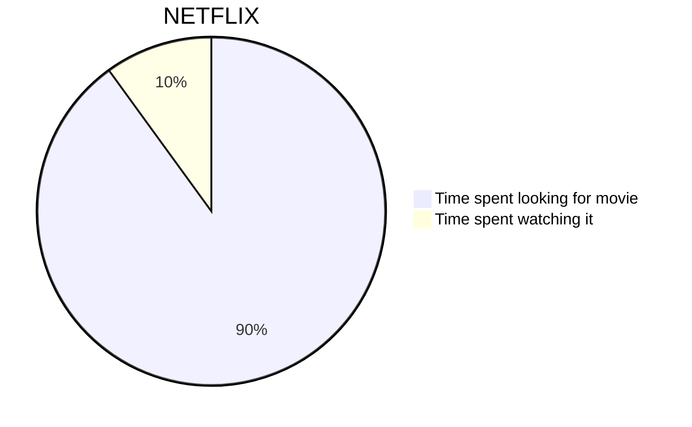

# H1
## H2
### H3
#### H4
##### H5
###### H6

---

**bold text**

*italicized text*

> blockquote

1. First item
2. Second item
3. Third item

- First item
- Second item
- Third item

`code`

[title](https://www.example.com)

| Syntax | Onderwerp |
| ----------- | ----------- |
| Header | Title |
| Paragraph | Text |

```
{
  "firstName": "John",
  "lastName": "Smith",
  "age": 25
}
```

Here's a sentence with a footnote. [^1]

[^1]: This is the footnote.

### My Great Heading {#custom-id}

term
: definition

~~The world is flat.~~

- [x] Write the press release
- [ ] Update the website
- [ ] Contact the media

That is so funny! :joy:

I need to highlight these ==very important words==.